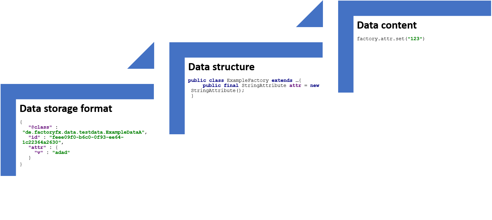

# Migration
Data migration plays an important role in factoryfx because factoryfx unites data and application structure into one factory structure. Migrations are required not only for data changes but also for application structure changes. 
To simplify the migration process factoryfx provides a dedicated migration API.

In factoryfx we distinguish between 3 layers of migrations
* **Data storage format**<br> The general format how data and attributes are stored.
* **Data structure**<br> Structure of the Factories e.g.: attributes name, factory names
* **Data content**<br> Data content changes


## Data storage format migration
```json
{
  "@class" : "io.github.factoryfx.data.merge.testdata.ExampleDataA",
  "id" : "feee09f0-b6c0-0f93-ee64-1c22364a2630",
  "stringAttribute" : {
    "v" : "adad"
  }
}
```
This is an example for the json format of a factory with a StringAttribute.
The StringAttribute is serialized to a nested object and the value is stored in the "v" attribute. 
This rather unusual structure can be put down to limitations of Jackson.
The structure format is mostly stable but may change if, for example Jackson adds a new useful feature in the future.

Data storage format migrations are applied as one time migration with the patch API.
```java 
MicroserviceBuilder#withGeneralMigration
MicroserviceBuilder#withGeneralStorageMetadata
```
This should hardly be necessary in practice.

## Data structure migration
The more common case are refactorings in the factory structure. (comparable to refactoring operations in the IDE)
```java
public class ExampleFactory extends SimpleFactoryBase<Void,Void,ExampleFactory> {
    public final StringAttribute oldAttribute= new StringAttribute();
}
public class ExampleFactory extends SimpleFactoryBase<Void,Void,ExampleFactory> {
    public final StringAttribute newAttribute= new StringAttribute();
}
```
In this example the for attribute is renamed from "oldAttribute" to "newAttribute".

```java
builder.withRenameAttributeMigration(ExampleFactory.class,"oldAttribute",(rf)->rf.newAttribute)
```
This adds a rename migration. To support multiple renames the new name is provided as a lambada expression and thereby enables IDE refactoring for the migrations. This also prevents rename cycles.
Migrations are added with the MicroserviceBuilder.

## Data content
There is no special framework support for data changes because it's too project specific. 
You can use the normal microservice update API or DataStorage API.


## Special case: One time migration
Normally the migrations are executed on the fly when the data is loaded from memory. 
This has the advantage that a faulty migration can't destroy old data. Mistakes in the migration code are easier to fix because you don't have repair data. 

In some cases it can be convenient to execute a one time migration. For that case the storage api has a special api.

The mayor difference of a one time migration is that the data are updated in the storage after the migration. 

## Example
[**code**](https://github.com/factoryfx/factoryfx/tree/master/docu/src/main/java/io/github/factoryfx/docu/migration)